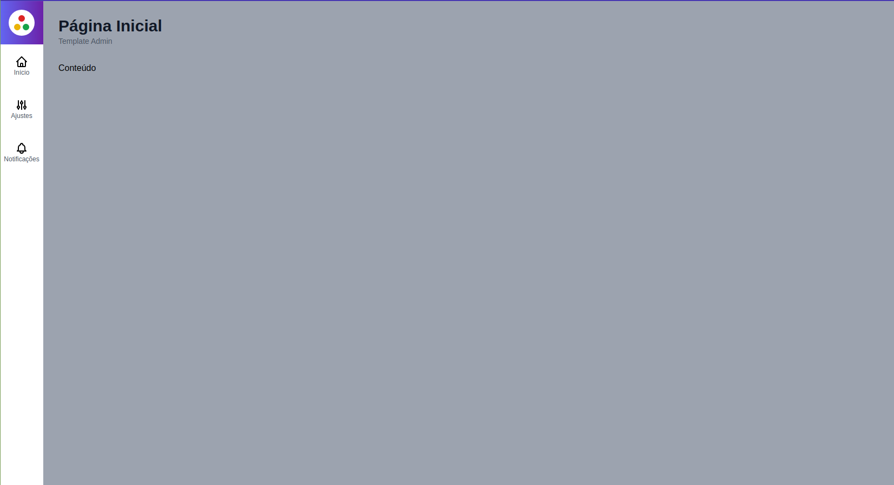

## 📜 Descrição

- Projeto de um template admin básico construído com propósito de ser reutilizado em futuros projetos.

- A estrutura é padrão, onde cada opção do menu redireciona para uma rota programada para um component.

- O projeto possui componente de autenticação de usuário com firebase.
## 💻 Tecnologias Utilizadas

- Next Js
- React Js
- TypeScript
- Tailwind CSS
- Firebase

## 🎞️ Tela principal

